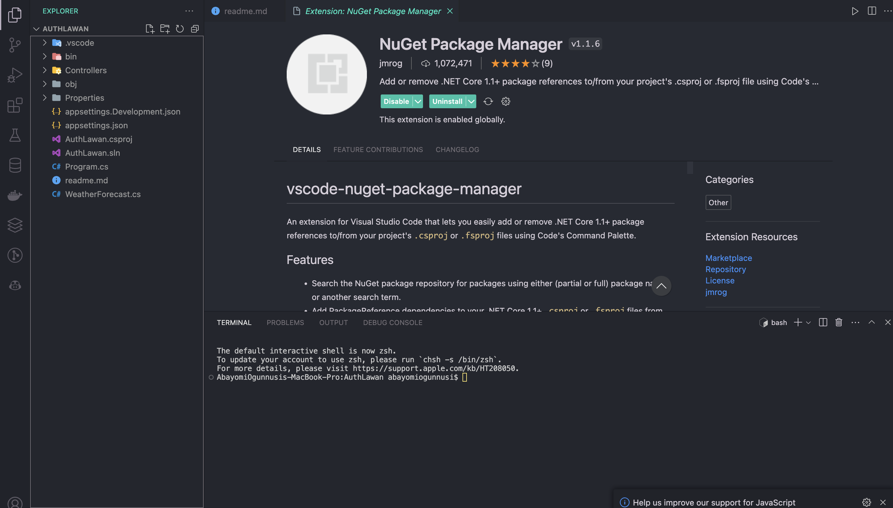

#### On vscode install Nuget package manager


##### Using Nuget package manager:
Ctrol + Shift + P -> Nuget Package Manager -> Add Package -> Microsoft.EntityFrameworkCore.SqlServer

- Microsoft.AspNetCore.Authentication.JwtBearer

or using dotnet cli:
```bash
dotnet add package Microsoft.EntityFrameworkCore.SqlServer
dotnet add package Microsoft.AspNetCore.Authentication.JwtBearer
dotnet add package Microsoft.AspNetCore.Identity.EntityFrameworkCore
dotnet add package Microsoft.AspNetCore.Identity.UI
dotnet add package Microsoft.EntityFrameworkCore.Sqlite
dotnet add package Microsoft.EntityFrameworkCore.Tools
```

######  Instal JUST Microsoft.AspNetCore.Identity
- dotnet add package Microsoft.AspNetCore.Identity.EntityFrameworkCore